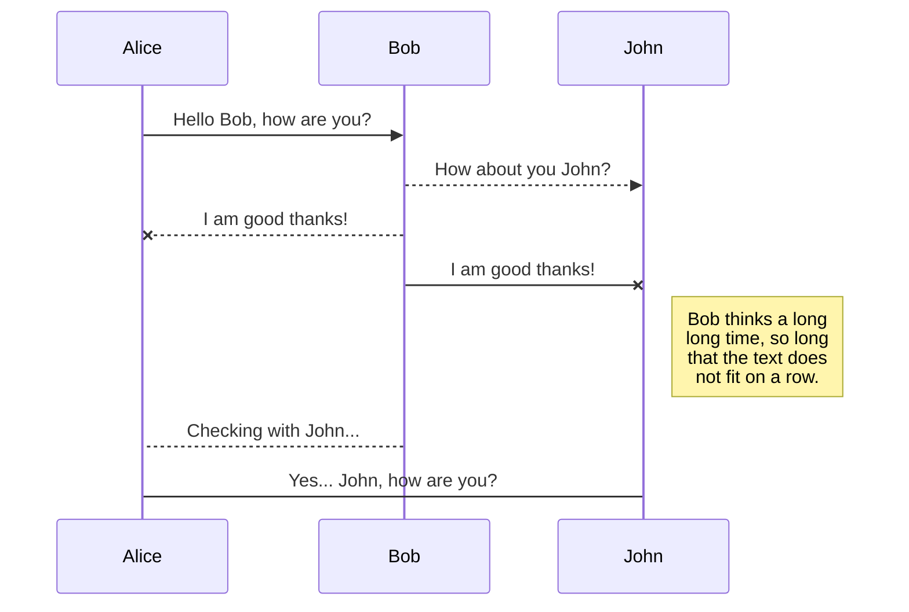
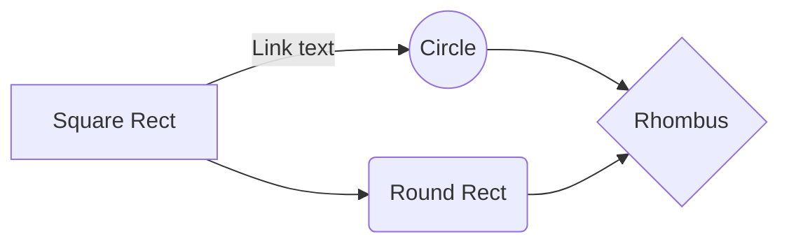

# 見出し

- IN

```
# 見出し1
## 見出し2
### 見出し3
#### 見出し4
##### 見出し5
###### 見出し6
```

- OUT

# 見出し1
## 見出し2
### 見出し3
#### 見出し4
##### 見出し5
###### 見出し6


# 色コード

- IN

```
 `#c7e7f6`
 `#abdbf1`
 `#6ec1e9`
 `#47b1e1`
 `#0093d6`
 `#221816`
```

- OUT

 `#c7e7f6`
 `#abdbf1`
 `#6ec1e9`
 `#47b1e1`
 `#0093d6`
 `#221816`

# インラインコード

- IN

```
これは `echo うんこ`です。
```

- OUT

これは `echo うんこ`です。


# ノンインラインコード

- IN

```

​```

#!/usr/bin/env bash


echo うんこ

​```

```

- OUT


```

#!/usr/bin/env bash


echo うんこ

```


# ノンオーダリスト

- IN

```
- リスト1
    - リスト1-1
        - リスト1-1-1
        - リスト1-1-2
    - リスト1-2
- リスト2
- リスト3
```

- OUT

- リスト1
    - リスト1-1
        - リスト1-1-1
        - リスト1-1-2
    - リスト1-2
- リスト2
- リスト3

# オーダリスト

- IN

```
1. 番号付きリスト1
    1. 番号付きリスト1-1
    1. 番号付きリスト1-2
1. 番号付きリスト2
1. 番号付きリスト3
```

- OUT

1. 番号付きリスト1
    1. 番号付きリスト1-1
    1. 番号付きリスト1-2
1. 番号付きリスト2
1. 番号付きリスト3

# 引用

- IN

```

> **Note:**  Interfere when the enemy is making a mistake.

```


- OUT

> **Note:**  Interfere when the enemy is making a mistake.


# リンク

- IN

```
[pngフリー画像集](https://www.pngonly.com/owl-png/)
```

- OUT

[pngフリー画像集](https://www.pngonly.com/owl-png/)

# 強調表示

- IN

```
これは **うんこ** です
```

- OUT

これは **うんこ** です


# 画像

```bash
curl -sSLO https://www.pngonly.com/wp-content/uploads/2017/06/Owl-Close-PNG-Photo.png
```

- IN

```


```


- OUT


# テーブル

- IN

```
|                  | ASCII                           | HTML                          |
| ---------------- | ------------------------------- | ----------------------------- |
| Single backticks | `'Isn't this fun?'`             | 'Isn't this fun?'             |
| Quotes           | `"Isn't this fun?"`             | "Isn't this fun?"             |
| Dashes           | `-- is en-dash, --- is em-dash` | -- is en-dash, --- is em-dash |

```

- OUT

|                  | ASCII                           | HTML                          |
| ---------------- | ------------------------------- | ----------------------------- |
| Single backticks | `'Isn't this fun?'`             | 'Isn't this fun?'             |
| Quotes           | `"Isn't this fun?"`             | "Isn't this fun?"             |
| Dashes           | `-- is en-dash, --- is em-dash` | -- is en-dash, --- is em-dash |


- IN


```
| 左揃え | 中央揃え | 右揃え |
|:--|:--:|--:|
|1 |2 |3 |
|4 |5 |6 |

```

- OUT

| 左揃え | 中央揃え | 右揃え |
|:--|:--:|--:|
|1 |2 |3 |
|4 |5 |6 |


- IN


```

|`code`    |*italic*                  |
|:--:|:--:|
|**bold**  |***bold italic***         |
|$ omega $|[Qiita](http://qiita.com)|
```


- OUT

texうまくいかんな

|`code`    |*italic*                  |
|:--:|:--:|
|**bold**  |***bold italic***         |
|$ omega $|[Qiita](http://qiita.com)|


# tex

- https://qiita.com/MuAuan/items/64dc82030a9ec4f5cef9

The *Gamma function* satisfying $\Gamma(n) = (n-1)!\quad\forall n\in\mathbb N$ is via the Euler integral

$$
\Gamma(z) = \int_0^\infty t^{z-1}e^{-t}dt\,.
$$

> You can find more information about **LaTeX** mathematical expressions [here](http://meta.math.stackexchange.com/questions/5020/mathjax-basic-tutorial-and-quick-reference).


# UML diagrams

これはvscodeでdraw.ioができるようになったから、あんま使わんかも？？

You can render UML diagrams using [Mermaid](https://mermaidjs.github.io/). For example, this will produce a sequence diagram:



And this will produce a flow chart:


