# javaspringいい感じそうなサンプル

https://www.journaldev.com/14476/spring-mvc-example

https://howtodoinjava.com/spring-mvc/spring-mvc-hello-world-example/


# eclipseとideaのダウンロード

eclipse

https://www.eclipse.org/downloads/download.php?file=/oomph/epp/2019-12/R/eclipse-inst-linux64.tar.gz

idea

https://www.jetbrains.com/idea/download/download-thanks.html?platform=linux&code=IIC

# eclipseインストーラの起動

```bash
$cd eclipse-installer/
$./eclipse-inst 1>~/installer_eclipse.log 2>&1 &
```

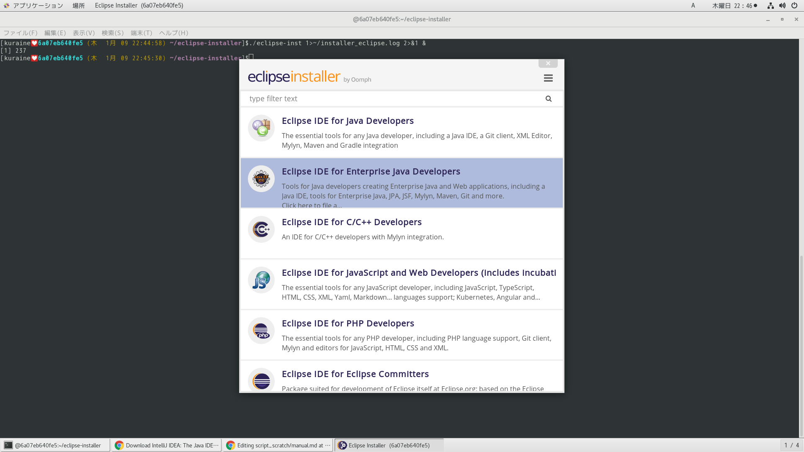
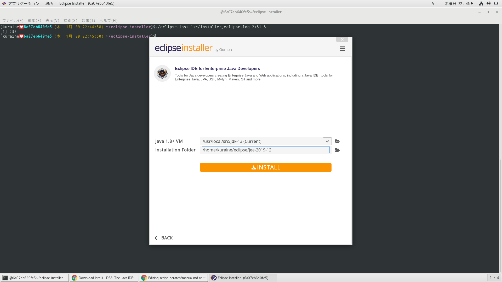
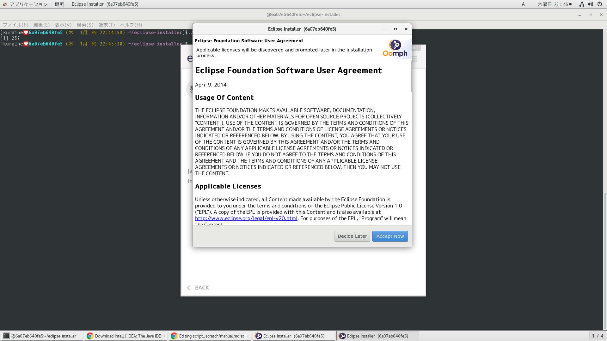
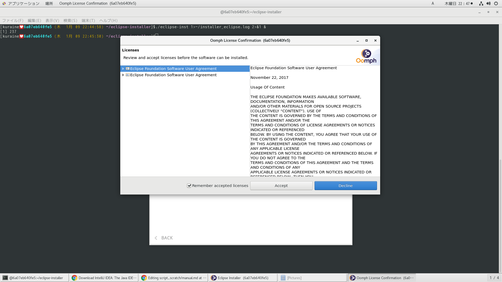
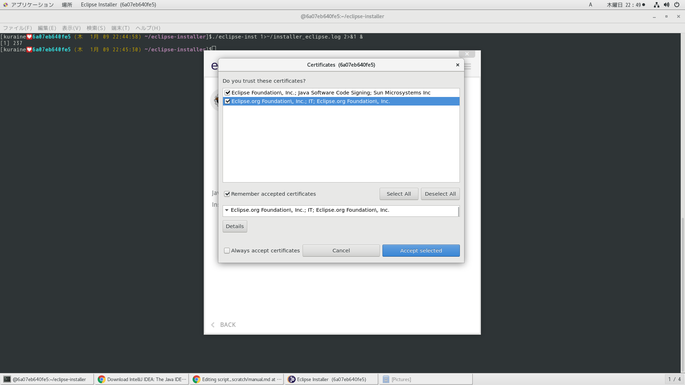
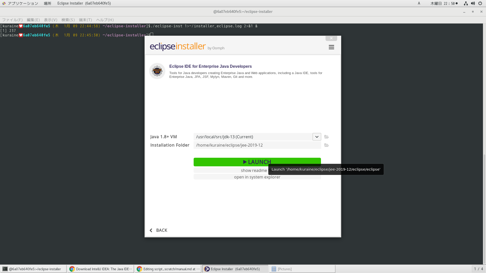
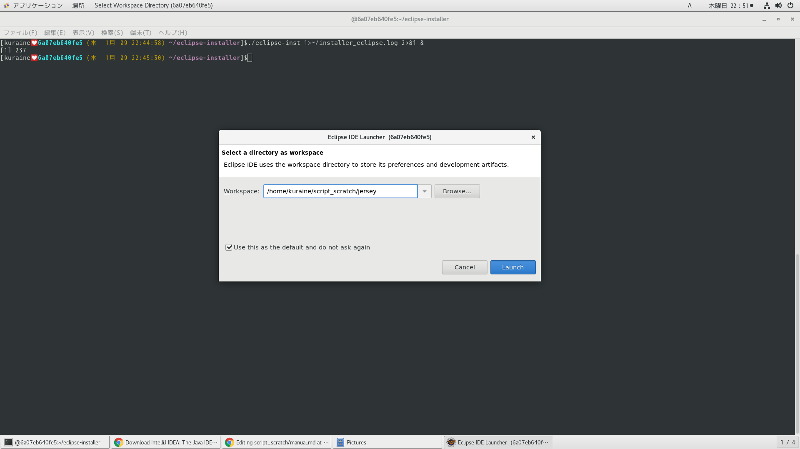
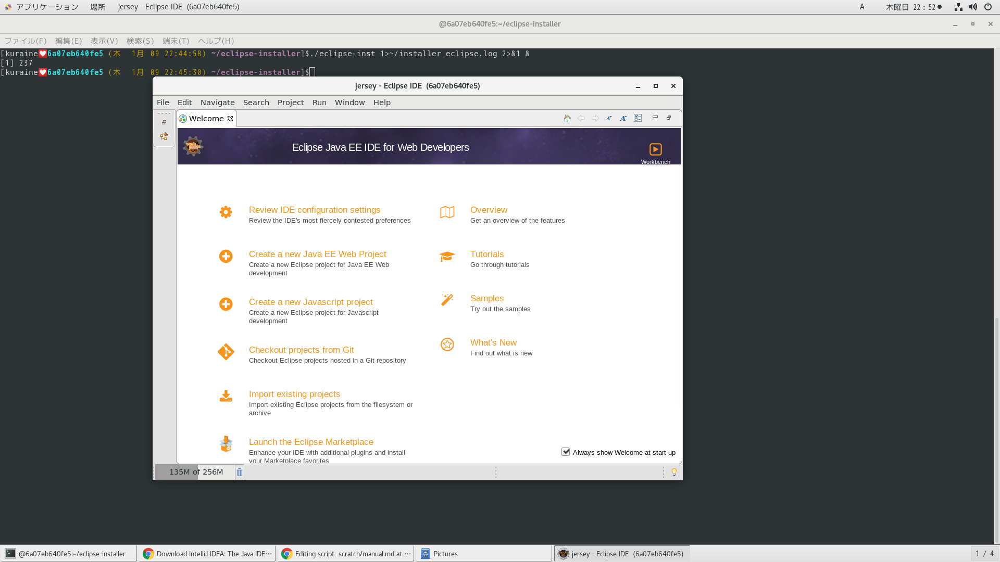

# ２回目以降のeclipseの起動

```
$ecli
```

デフォルトロケを以下に設定
```
$~/script_scratch/java-ee
```

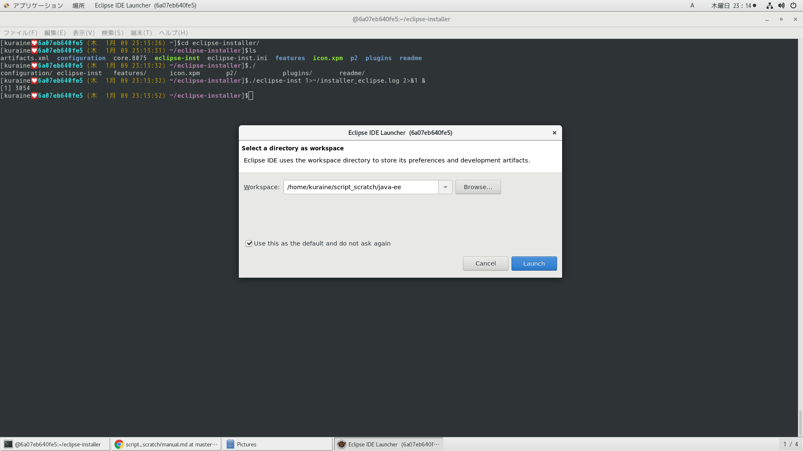


# プロジェクトの作成

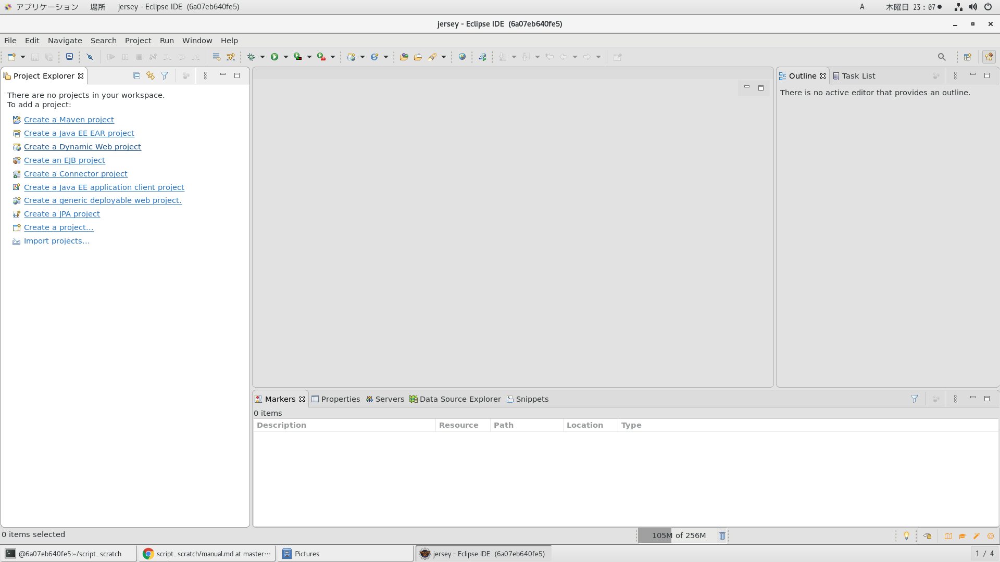
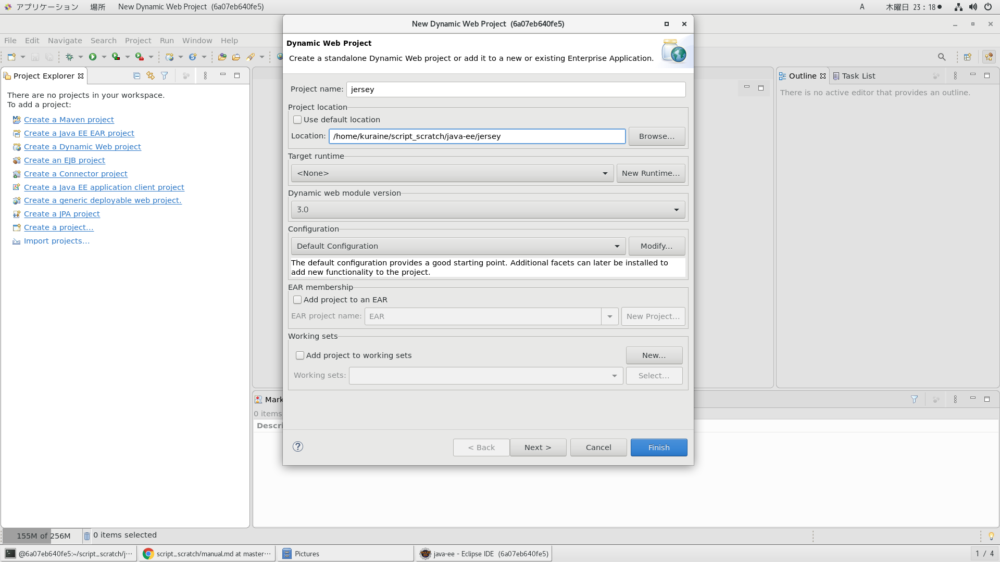
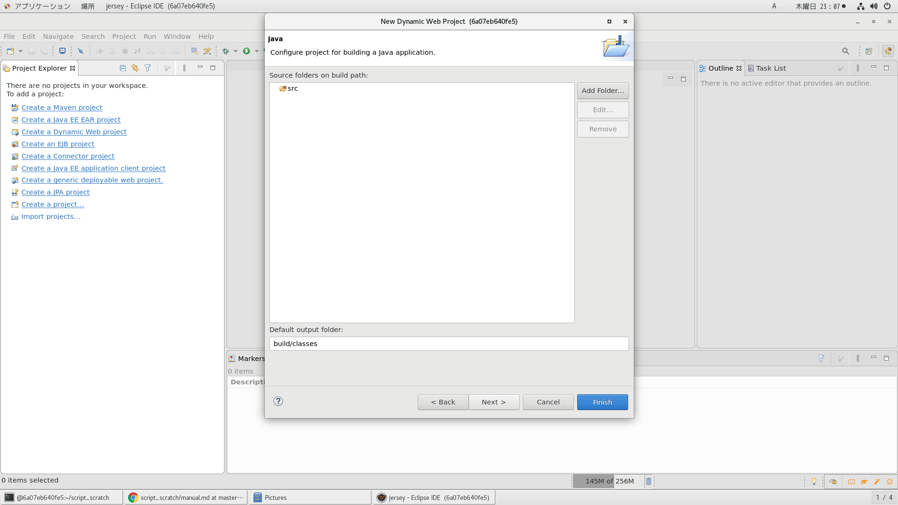
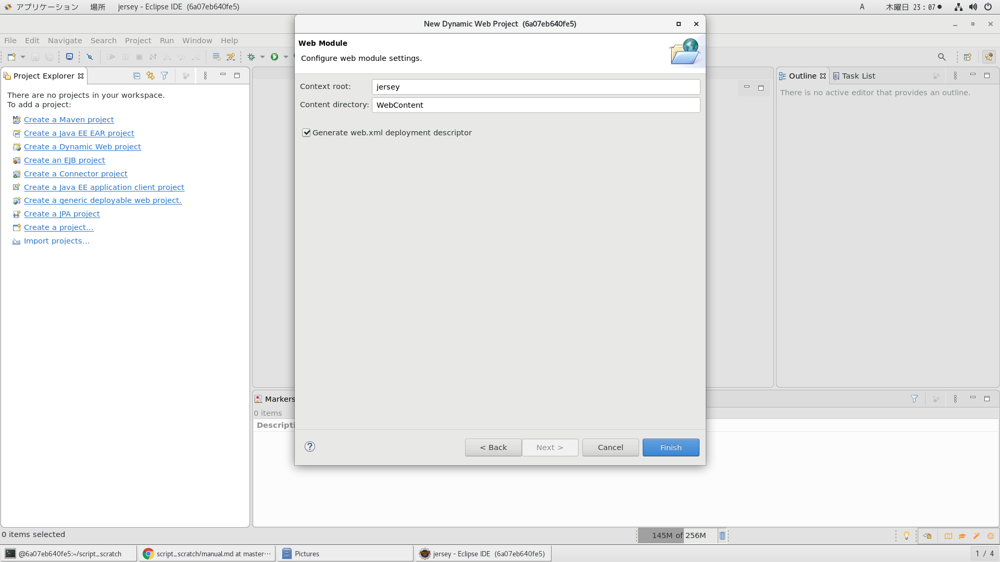


# ライブラリの配備

```bash
$find ~/jaxrs-ri -name "*jar" | xargs -I@ cp @ ~/script_scratch/java-ee/jersey/WebContent/WEB-INF/lib
$tree jersey/
jersey/
|-- WebContent
|   |-- META-INF
|   |   `-- MANIFEST.MF
|   `-- WEB-INF
|       |-- lib
|       |   |-- aopalliance-repackaged-2.6.1.jar
|       |   |-- hk2-api-2.6.1.jar
|       |   |-- hk2-locator-2.6.1.jar
|       |   |-- hk2-utils-2.6.1.jar
|       |   |-- jakarta.activation-api-1.2.1.jar
|       |   |-- jakarta.annotation-api-1.3.5.jar
|       |   |-- jakarta.inject-2.6.1.jar
|       |   |-- jakarta.json-1.1.5.jar
|       |   |-- jakarta.json-api-1.1.5.jar
|       |   |-- jakarta.json.bind-api-1.0.2.jar
|       |   |-- jakarta.persistence-api-2.2.3.jar
|       |   |-- jakarta.servlet-api-4.0.3.jar
|       |   |-- jakarta.validation-api-2.0.2.jar
|       |   |-- jakarta.ws.rs-api-2.1.6-sources.jar
|       |   |-- jakarta.ws.rs-api-2.1.6.jar
|       |   |-- jakarta.xml.bind-api-2.3.2.jar
|       |   |-- javassist-3.25.0-GA.jar
|       |   |-- jersey-client.jar
|       |   |-- jersey-common.jar
|       |   |-- jersey-container-servlet-core.jar
|       |   |-- jersey-container-servlet.jar
|       |   |-- jersey-hk2.jar
|       |   |-- jersey-media-jaxb.jar
|       |   |-- jersey-media-json-binding.jar
|       |   |-- jersey-media-sse.jar
|       |   |-- jersey-server.jar
|       |   |-- org.osgi.core-6.0.0.jar
|       |   |-- osgi-resource-locator-1.0.3.jar
|       |   `-- yasson-1.0.3.jar
|       |-- resource
|       `-- web.xml
|-- build
|   `-- classes
|       `-- lesson01
|           |-- MyApplication.class
|           `-- MyResource.class
`-- src
    `-- lesson01
        |-- MyApplication.java
        `-- MyResource.java

10 directories, 35 files

```

# packageディレクトリとresourceデイレクトリの作成

```
$mkdir -p /home/kuraine/script_scratch/java-ee/jersey/src/lesson{01..01}
$mkdir -p /home/kuraine/script_scratch/java-ee/jersey/WebContent/WEB-INF/resource
```

# MyApplication.javaファイルの作成

```java
package lesson01;

import javax.ws.rs.ApplicationPath;

import org.glassfish.jersey.server.ResourceConfig;

@ApplicationPath("/api")
public class MyApplication extends ResourceConfig{
    public MyApplication() {
        packages("lesson01");
    }
}
```

# MyResource.javaファイルの作成

```java
package lesson01;

import java.io.FileOutputStream;
import java.io.IOException;
import java.nio.file.Files;
import java.nio.file.Paths;

import javax.ws.rs.Consumes;
import javax.ws.rs.GET;
import javax.ws.rs.POST;
import javax.ws.rs.Path;
import javax.ws.rs.Produces;
import javax.ws.rs.core.Context;
import javax.ws.rs.core.MediaType;
import javax.ws.rs.core.UriInfo;

@Path("/")
public class MyResource {

    private final static String RESOURCE_DIR="/home/kuraine/script_scratch/java-ee/jersey/WebContent/WEB-INF/resource";

    @Context
    private UriInfo uriInfo;

    @Path("/hello-txt")
    @GET
    @Produces(MediaType.TEXT_PLAIN)
    public String hello_txt() {
        return "Hello,World!";
    }

    @Path("/info-txt")
    @GET
    @Produces(MediaType.TEXT_PLAIN)
    public String info_txt() {
        //「/jersey/api/info-txt」が返却されてくる。
        return uriInfo.getAbsolutePath().getPath();
    }

    //$curl -X POST -H "Content-type: text/plain" --data 'うんこ' http://localhost:8080/jersey/api/post-txt
    //https://qiita.com/AkihiroTakamura/items/b93fbe511465f52bffaa
    @Path("/post-txt")
    @POST
    @Consumes(MediaType.TEXT_PLAIN)//追加
    public void post_txt(String dat) {
        String post_dst="/test.txt";
        try {
            FileOutputStream fos = new FileOutputStream(RESOURCE_DIR+post_dst);
            byte[] daz = dat.getBytes();
            fos.write(daz);
            fos.flush();
            fos.close();
        } catch (IOException e) {
            e.printStackTrace();
        }
    }

    //$ curl -X POST -H "Content-type: text/plain" -d '{"Name":"sensuikan1973", "Age":"100"}' http://localhost:8080/jersey/api/post-json
    //https://www.sonnagaya.com/entry/20140604/1401842716
    //http://blog.rakugakibox.net/entry/2014/10/28/glassfish_jaxrs_java
    //どこまで受け取れるかが問題nodeで大量jsonデータ作成
    @Path("/post-json")
    @POST
    @Consumes(MediaType.TEXT_PLAIN)//追加
    public void post_json(String dat) {
        String post_dst="/test.json";
        try {
            FileOutputStream fos = new FileOutputStream(RESOURCE_DIR+post_dst);
            byte[] daz = dat.getBytes();
            fos.write(daz);
            fos.flush();
            fos.close();
        } catch (IOException e) {
            e.printStackTrace();
        }
    }

    @Path("/hello-json")
    @GET
    @Produces(MediaType.APPLICATION_JSON)
    public String hello_json() {
        return getResouce("test1.json");
    }

    private static String getResouce(String tgt) {
        java.nio.file.Path file = Paths.get(RESOURCE_DIR+"/"+tgt);
        String rt=null;
        try {
            rt = Files.readString(file);
        } catch (IOException e) {
            e.printStackTrace();
        }
        return rt;
    }
}
```


# warファイルの作成

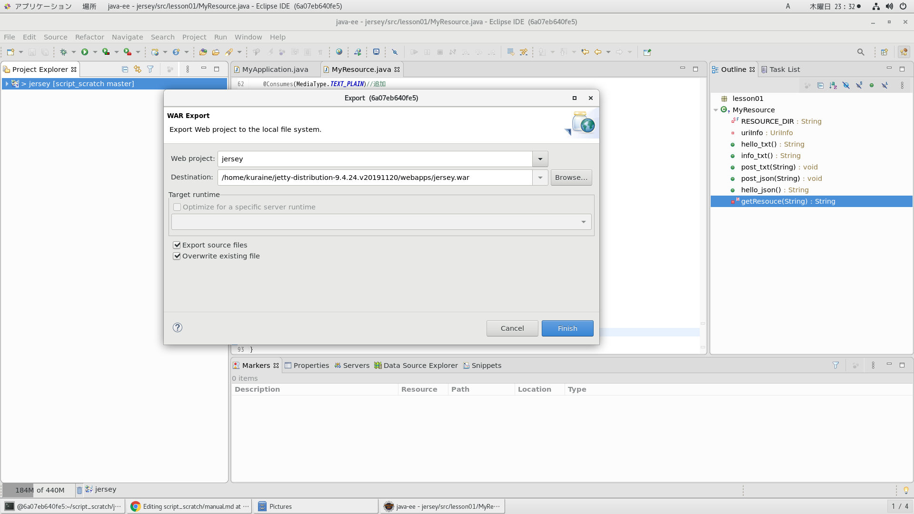


# warファイルの作成（コマンドライン経由）

プロジェクトツリー

```
$tree jersey-json-crud
jersey-json-crud
|-- WebContent
|   |-- META-INF
|   |   `-- MANIFEST.MF
|   `-- WEB-INF
|       |-- classes
|       |   `-- main
|       |       `-- java
|       |           `-- app
|       |               |-- MyApplication.class
|       |               |-- MyResource.class
|       |               `-- TelegramPattern2.class
|       |-- lib
|       |   |-- aopalliance-repackaged-2.6.1.jar
|       |   |-- hk2-api-2.6.1.jar
|       |   |-- hk2-locator-2.6.1.jar
|       |   |-- hk2-utils-2.6.1.jar
|       |   |-- jakarta.activation-1.2.1.jar
|       |   |-- jakarta.activation-api-1.2.1.jar
|       |   |-- jakarta.annotation-api-1.3.5.jar
|       |   |-- jakarta.inject-2.6.1.jar
|       |   |-- jakarta.json-1.1.5.jar
|       |   |-- jakarta.json-api-1.1.5.jar
|       |   |-- jakarta.json.bind-api-1.0.2.jar
|       |   |-- jakarta.validation-api-2.0.2.jar
|       |   |-- jakarta.ws.rs-api-2.1.6.jar
|       |   |-- jakarta.xml.bind-api-2.3.2.jar
|       |   |-- javassist-3.25.0-GA.jar
|       |   |-- jaxrs-ri-2.30.jar
|       |   |-- jersey-client-2.30.jar
|       |   |-- jersey-common-2.30.jar
|       |   |-- jersey-container-servlet-2.30.jar
|       |   |-- jersey-container-servlet-core-2.30.jar
|       |   |-- jersey-hk2-2.30.jar
|       |   |-- jersey-media-jaxb-2.30.jar
|       |   |-- jersey-media-json-binding-2.30.jar
|       |   |-- jersey-media-sse-2.30.jar
|       |   |-- jersey-server-2.30.jar
|       |   |-- osgi-resource-locator-1.0.3.jar
|       |   `-- yasson-1.0.3.jar
|       `-- web.xml
|-- build
|   `-- classes
|       `-- main
|           |-- java
|           |   `-- app
|           |       |-- MyApplication.class
|           |       |-- MyResource.class
|           |       `-- TelegramPattern2.class
|           `-- resource
|               |-- test1.json
|               `-- test2.json
|-- jersey-json-crud.iml
|-- jersey-json-crud.war
|-- pom.xml
`-- src
    `-- main
        |-- java
        |   `-- app
        |       |-- MyApplication.java
        |       |-- MyResource.java
        |       `-- TelegramPattern2.java
        `-- resource
            |-- test1.json
            `-- test2.json

19 directories, 45 files
```

プロジェクトのディレクトリに入る

```
$cd ~/script_scratch/java-ee/jersey-json-crud
```


コンパイルしてクラスファイル作成

クラスパスはダブルクォートで囲むこと

```
$javac -cp "WebContent/WEB-INF/lib/*" -d WebContent/WEB-INF/classes src/main/java/app/*
```


サーバーのwebappフォルダにwarファイル配備

```

$jar -cvf ~/jetty-distribution-9.4.24.v20191120/webapps/jersey-json-crud.war -C WebContent .
マニフェストが追加されました
エントリMETA-INF/を無視します
エントリMETA-INF/MANIFEST.MFを無視します
WEB-INF/を追加中です(入=0)(出=0)(0%格納されました)
WEB-INF/classes/を追加中です(入=0)(出=0)(0%格納されました)
WEB-INF/classes/main/を追加中です(入=0)(出=0)(0%格納されました)
WEB-INF/classes/main/java/を追加中です(入=0)(出=0)(0%格納されました)
WEB-INF/classes/main/java/app/を追加中です(入=0)(出=0)(0%格納されました)
WEB-INF/classes/main/java/app/TelegramPattern2.classを追加中です(入=1133)(出=542)(52%収縮されました)
WEB-INF/classes/main/java/app/MyResource.classを追加中です(入=2677)(出=1331)(50%収縮されました)
WEB-INF/classes/main/java/app/MyApplication.classを追加中です(入=484)(出=333)(31%収縮されました)
WEB-INF/web.xmlを追加中です(入=718)(出=404)(43%収縮されました)
WEB-INF/lib/を追加中です(入=0)(出=0)(0%格納されました)
WEB-INF/lib/jakarta.ws.rs-api-2.1.6.jarを追加中です(入=140376)(出=121810)(13%収縮されました)
WEB-INF/lib/jersey-common-2.30.jarを追加中です(入=1166647)(出=1017139)(12%収縮されました)
WEB-INF/lib/jakarta.xml.bind-api-2.3.2.jarを追加中です(入=115498)(出=98987)(14%収縮されました)
WEB-INF/lib/hk2-locator-2.6.1.jarを追加中です(入=203358)(出=190176)(6%収縮されました)
WEB-INF/lib/yasson-1.0.3.jarを追加中です(入=313516)(出=274095)(12%収縮されました)
WEB-INF/lib/aopalliance-repackaged-2.6.1.jarを追加中です(入=27006)(出=21930)(18%収縮されました)
WEB-INF/lib/jersey-server-2.30.jarを追加中です(入=927721)(出=813727)(12%収縮されました)
WEB-INF/lib/javassist-3.25.0-GA.jarを追加中です(入=780265)(出=725815)(6%収縮されました)
WEB-INF/lib/jersey-container-servlet-2.30.jarを追加中です(入=32091)(出=27851)(13%収縮されました)
WEB-INF/lib/jersey-media-json-binding-2.30.jarを追加中です(入=26194)(出=23048)(12%収縮されました)
WEB-INF/lib/jersey-client-2.30.jarを追加中です(入=244502)(出=216132)(11%収縮されました)
WEB-INF/lib/jakarta.annotation-api-1.3.5.jarを追加中です(入=25058)(出=21985)(12%収縮されました)
WEB-INF/lib/hk2-api-2.6.1.jarを追加中です(入=200223)(出=176122)(12%収縮されました)
WEB-INF/lib/hk2-utils-2.6.1.jarを追加中です(入=131590)(出=117610)(10%収縮されました)
WEB-INF/lib/jakarta.activation-1.2.1.jarを追加中です(入=65690)(出=59562)(9%収縮されました)
WEB-INF/lib/jakarta.activation-api-1.2.1.jarを追加中です(入=44399)(出=40073)(9%収縮されました)
WEB-INF/lib/jersey-media-sse-2.30.jarを追加中です(入=77709)(出=68820)(11%収縮されました)
WEB-INF/lib/jersey-container-servlet-core-2.30.jarを追加中です(入=73349)(出=63889)(12%収縮されました)
WEB-INF/lib/jakarta.json-api-1.1.5.jarを追加中です(入=43364)(出=38089)(12%収縮されました)
WEB-INF/lib/jersey-media-jaxb-2.30.jarを追加中です(入=85815)(出=75050)(12%収縮されました)
WEB-INF/lib/jakarta.inject-2.6.1.jarを追加中です(入=18140)(出=16603)(8%収縮されました)
WEB-INF/lib/jersey-hk2-2.30.jarを追加中です(入=76733)(出=66821)(12%収縮されました)
WEB-INF/lib/jakarta.json-1.1.5.jarを追加中です(入=140564)(出=127356)(9%収縮されました)
WEB-INF/lib/jaxrs-ri-2.30.jarを追加中です(入=6032068)(出=5442716)(9%収縮されました)
WEB-INF/lib/jakarta.json.bind-api-1.0.2.jarを追加中です(入=35321)(出=29954)(15%収縮されました)
WEB-INF/lib/jakarta.validation-api-2.0.2.jarを追加中です(入=91930)(出=68631)(25%収縮されました)
WEB-INF/lib/osgi-resource-locator-1.0.3.jarを追加中です(入=19479)(出=16443)(15%収縮されました)
```


warファイルの中身

```
$jar tf ~/jetty-distribution-9.4.24.v20191120/webapps/jersey-json-crud.war
META-INF/
META-INF/MANIFEST.MF
WEB-INF/
WEB-INF/classes/
WEB-INF/classes/main/
WEB-INF/classes/main/java/
WEB-INF/classes/main/java/app/
WEB-INF/classes/main/java/app/TelegramPattern2.class
WEB-INF/classes/main/java/app/MyResource.class
WEB-INF/classes/main/java/app/MyApplication.class
WEB-INF/web.xml
WEB-INF/lib/
WEB-INF/lib/jakarta.ws.rs-api-2.1.6.jar
WEB-INF/lib/jersey-common-2.30.jar
WEB-INF/lib/jakarta.xml.bind-api-2.3.2.jar
WEB-INF/lib/hk2-locator-2.6.1.jar
WEB-INF/lib/yasson-1.0.3.jar
WEB-INF/lib/aopalliance-repackaged-2.6.1.jar
WEB-INF/lib/jersey-server-2.30.jar
WEB-INF/lib/javassist-3.25.0-GA.jar
WEB-INF/lib/jersey-container-servlet-2.30.jar
WEB-INF/lib/jersey-media-json-binding-2.30.jar
WEB-INF/lib/jersey-client-2.30.jar
WEB-INF/lib/jakarta.annotation-api-1.3.5.jar
WEB-INF/lib/hk2-api-2.6.1.jar
WEB-INF/lib/hk2-utils-2.6.1.jar
WEB-INF/lib/jakarta.activation-1.2.1.jar
WEB-INF/lib/jakarta.activation-api-1.2.1.jar
WEB-INF/lib/jersey-media-sse-2.30.jar
WEB-INF/lib/jersey-container-servlet-core-2.30.jar
WEB-INF/lib/jakarta.json-api-1.1.5.jar
WEB-INF/lib/jersey-media-jaxb-2.30.jar
WEB-INF/lib/jakarta.inject-2.6.1.jar
WEB-INF/lib/jersey-hk2-2.30.jar
WEB-INF/lib/jakarta.json-1.1.5.jar
WEB-INF/lib/jaxrs-ri-2.30.jar
WEB-INF/lib/jakarta.json.bind-api-1.0.2.jar
WEB-INF/lib/jakarta.validation-api-2.0.2.jar
WEB-INF/lib/osgi-resource-locator-1.0.3.jar
```


# jettyプロセス起動

```
$jetty.sh start 1>~/launch_jetty.log 2>&1 &
[1] 3872
```

プロセス確認

```
$ps aux
USER       PID %CPU %MEM    VSZ   RSS TTY      STAT START   TIME COMMAND
kuraine      1  0.0  0.0  42696  1564 pts/0    Ss+  22:38   0:00 /usr/sbin/init
kuraine    187  0.0  0.0  15612  3604 pts/1    Ss   22:44   0:00 /bin/bash
kuraine    293  0.0  0.0  58904   884 pts/1    S    22:45   0:00 dbus-launch --autolaunch=bc74deaa9e044c079ed6fc963d084157 --binary-syntax --close-stderr
kuraine    294  0.0  0.0  60084  1504 ?        Ss   22:45   0:00 /usr/bin/dbus-daemon --fork --print-pid 5 --print-address 7 --session
kuraine   1467  0.0  0.0 187420  2920 ?        Sl   22:50   0:00 /usr/libexec/dconf-service
kuraine   3380  0.0  0.0 208828 12232 pts/1    S    23:14   0:00 /home/kuraine/eclipse/jee-2019-12/eclipse/eclipse -vmargs -Duser.dir=/home/kuraine/eclipse/jee-2019-12/eclipse
kuraine   3409 14.7  4.0 111337156 1307300 pts/1 Sl 23:14   2:57 /usr/local/src/jdk-13/bin/java -Dosgi.requiredJavaVersion=1.8 -Dosgi.instance.area.default=@user.home/eclipse-workspace -XX:+UseG1GC -XX:+UseStrin
kuraine   3498  0.1  0.1 103054184 65056 pts/1 SLl  23:14   0:01 /usr/libexec/webkit2gtk-4.0/WebKitWebProcess 2 129
kuraine   3500  0.0  0.1 103289976 38736 pts/1 SLl  23:14   0:00 /usr/libexec/webkit2gtk-4.0/WebKitNetworkProcess 3 129
kuraine   3897 72.5  0.9 12818384 307088 pts/1 Sl   23:34   0:04 /usr/local/src/jdk-13/bin/java -Djetty.home=/home/kuraine/jetty-distribution-9.4.24.v20191120 -Djetty.base=/home/kuraine/jetty-distribution-9.4.24
kuraine   3945  0.0  0.0  54304  1856 pts/1    R+   23:34   0:00 ps aux
```

ログ確認

```
$tail launch_jetty.log 
2020-01-09 23:34:10.423:WARN:oeja.AnnotationParser:qtp342597804-15: javax.servlet.http.Part scanned from multiple locations: jar:file:///home/kuraine/jetty-distribution-9.4.24.v20191120/lib/servlet-api-3.1.jar!/javax/servlet/http/Part.class, jar:file:///tmp/jetty-0_0_0_0-8080-jersey_war-_jersey-any-16838426481255115614.dir/webapp/WEB-INF/lib/jakarta.servlet-api-4.0.3.jar!/javax/servlet/http/Part.class
2020-01-09 23:34:10.423:WARN:oeja.AnnotationParser:qtp342597804-15: javax.servlet.http.WebConnection scanned from multiple locations: jar:file:///home/kuraine/jetty-distribution-9.4.24.v20191120/lib/servlet-api-3.1.jar!/javax/servlet/http/WebConnection.class, jar:file:///tmp/jetty-0_0_0_0-8080-jersey_war-_jersey-any-16838426481255115614.dir/webapp/WEB-INF/lib/jakarta.servlet-api-4.0.3.jar!/javax/servlet/http/WebConnection.class
2020-01-09 23:34:10.467:INFO:oeja.AnnotationConfiguration:main: Scanning elapsed time=87ms
2020-01-09 23:34:10.627:INFO:oejs.session:main: DefaultSessionIdManager workerName=node0
2020-01-09 23:34:10.627:INFO:oejs.session:main: No SessionScavenger set, using defaults
2020-01-09 23:34:10.627:INFO:oejs.session:main: node0 Scavenging every 600000ms
2020-01-09 23:34:10.950:INFO:oejsh.ContextHandler:main: Started o.e.j.w.WebAppContext@6302bbb1{jersey,/jersey,file:///tmp/jetty-0_0_0_0-8080-jersey_war-_jersey-any-16838426481255115614.dir/webapp/,AVAILABLE}{/home/kuraine/jetty-distribution-9.4.24.v20191120/webapps/jersey.war}
2020-01-09 23:34:10.961:INFO:oejs.AbstractConnector:main: Started ServerConnector@4c9e38{HTTP/1.1,[http/1.1]}{0.0.0.0:8080}
2020-01-09 23:34:10.962:INFO:oejs.Server:main: Started @1226ms
OK 2020年  1月  9日 木曜日 23:34:13 JST
```

# 動作確認


```
$curl http://localhost:8080/jersey/api/hello-txt
Hello,World!
```

# jettyプロセス停止

```
$jetty.sh stop
Stopping Jetty: OK
$ps aux
USER       PID %CPU %MEM    VSZ   RSS TTY      STAT START   TIME COMMAND
kuraine      1  0.0  0.0  42696  1564 pts/0    Ss+  22:38   0:00 /usr/sbin/init
kuraine    187  0.0  0.0  15612  3604 pts/1    Ss   22:44   0:00 /bin/bash
kuraine    293  0.0  0.0  58904   884 pts/1    S    22:45   0:00 dbus-launch --autolaunch=bc74deaa9e044c079ed6fc963d084157 --binary-syntax --close-stderr
kuraine    294  0.0  0.0  60084  1504 ?        Ss   22:45   0:00 /usr/bin/dbus-daemon --fork --print-pid 5 --print-address 7 --session
kuraine   1467  0.0  0.0 187420  2920 ?        Sl   22:50   0:00 /usr/libexec/dconf-service
kuraine   3380  0.0  0.0 208828 12232 pts/1    S    23:14   0:00 /home/kuraine/eclipse/jee-2019-12/eclipse/eclipse -vmargs -Duser.dir=/home/kuraine/eclipse/jee-2019-12/eclipse
kuraine   3409 11.7  4.0 111337156 1315020 pts/1 Sl 23:14   3:02 /usr/local/src/jdk-13/bin/java -Dosgi.requiredJavaVersion=1.8 -Dosgi.instance.area.default=@user.home/eclipse-workspace -XX:+UseG1GC -XX:+UseStrin
kuraine   3498  0.0  0.1 103054184 65056 pts/1 SLl  23:14   0:01 /usr/libexec/webkit2gtk-4.0/WebKitWebProcess 2 129
kuraine   3500  0.0  0.1 103289976 38736 pts/1 SLl  23:14   0:00 /usr/libexec/webkit2gtk-4.0/WebKitNetworkProcess 3 129
kuraine   3994  0.0  0.0  54304  1856 pts/1    R+   23:40   0:00 ps aux
```
