# Getting Started

### Reference Documentation
For further reference, please consider the following sections:

* [Official Apache Maven documentation](https://maven.apache.org/guides/index.html)
* [Spring Boot Maven Plugin Reference Guide](https://docs.spring.io/spring-boot/docs/2.2.3.RELEASE/maven-plugin/)
* [Spring Web](https://docs.spring.io/spring-boot/docs/2.2.3.RELEASE/reference/htmlsingle/#boot-features-developing-web-applications)

### Guides
The following guides illustrate how to use some features concretely:

* [Building a RESTful Web Service](https://spring.io/guides/gs/rest-service/)
* [Serving Web Content with Spring MVC](https://spring.io/guides/gs/serving-web-content/)
* [Building REST services with Spring](https://spring.io/guides/tutorials/bookmarks/)

# mavenコマンドの設定ファイル修正

以下を参考にデフォルトのライブラリダウンロード先を変更
https://maven.apache.org/settings.html

```
$touch $HOME/.m2/settings.xml
```

追記内容

localRepositoryディレクティブの値を
プロジェクト名までのフルパス/libに変更

ex.)プロジェクト名までのフルパスが/home/kuraine/script_scratch/java-ee/spring-appの場合
/home/kuraine/script_scratch/java-ee/spring-app/lib

```
<settings xmlns="http://maven.apache.org/SETTINGS/1.0.0"
  xmlns:xsi="http://www.w3.org/2001/XMLSchema-instance"
  xsi:schemaLocation="http://maven.apache.org/SETTINGS/1.0.0
                      https://maven.apache.org/xsd/settings-1.0.0.xsd">
  <localRepository>/home/kuraine/script_scratch/java-spring/spring-rest/lib</localRepository>
  <interactiveMode>true</interactiveMode>
  <offline>false</offline>
</settings>
```

# eclipseのstsプラグインでテンプレート作成

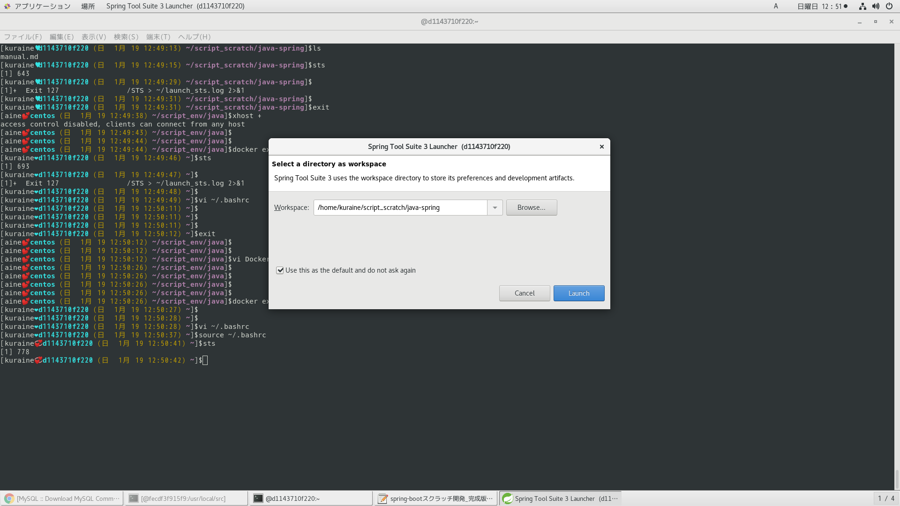

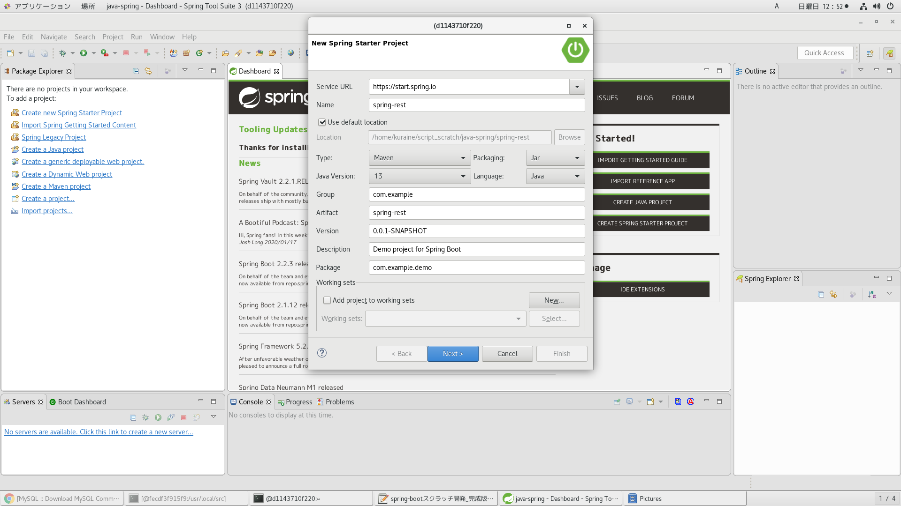
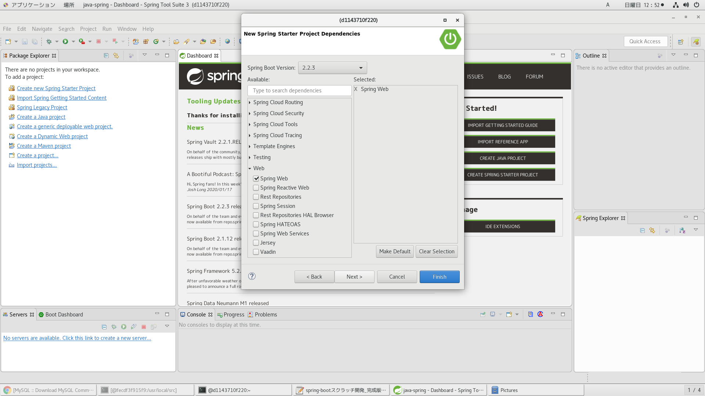
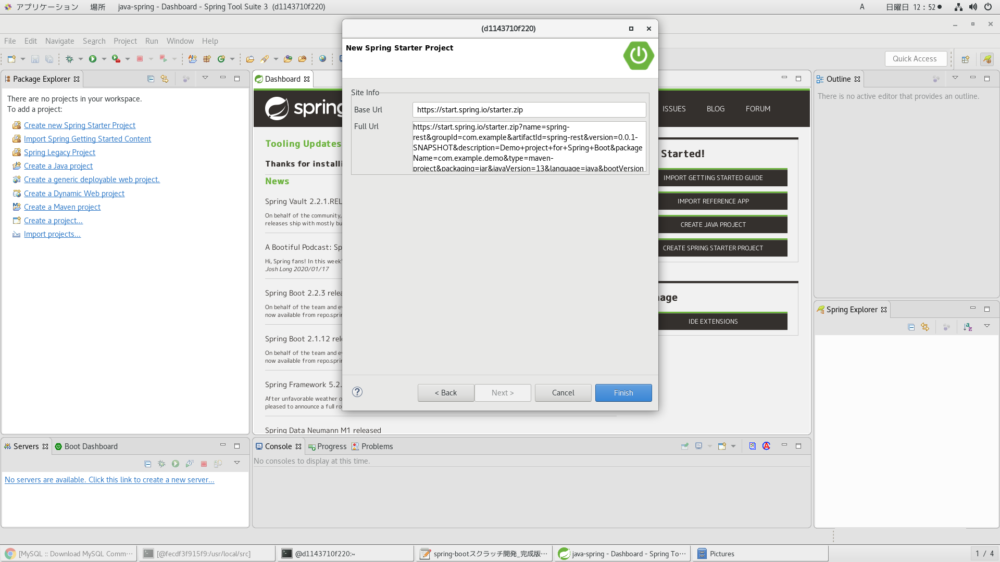

# ideaでプロジェクトをマウント

最新のパッチ当ててから起動。当てるときはrootユーザーで。
そのあとは一般ユーザーで作業。

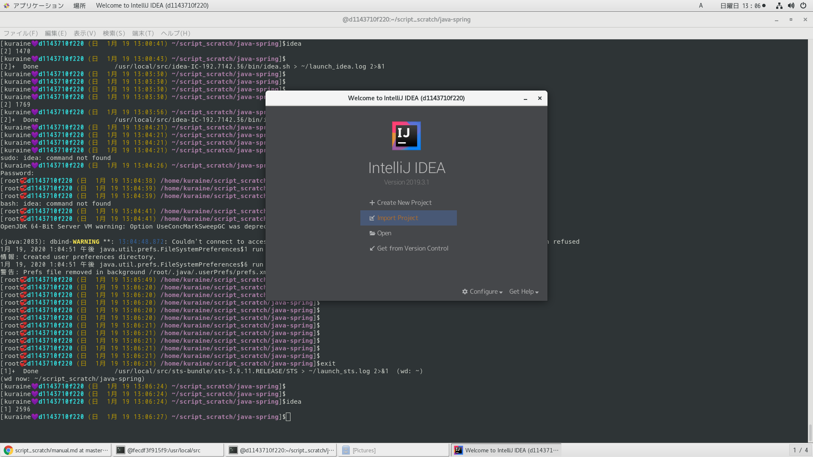
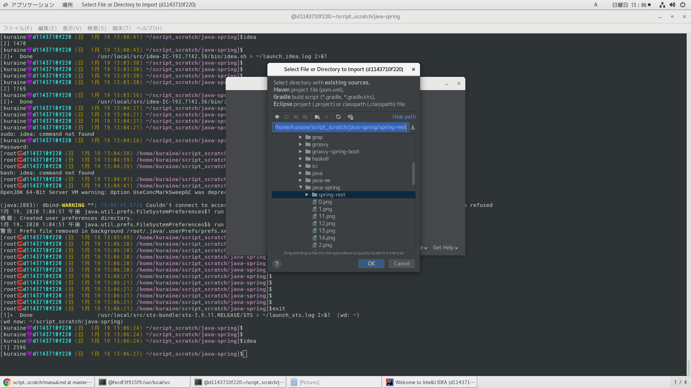
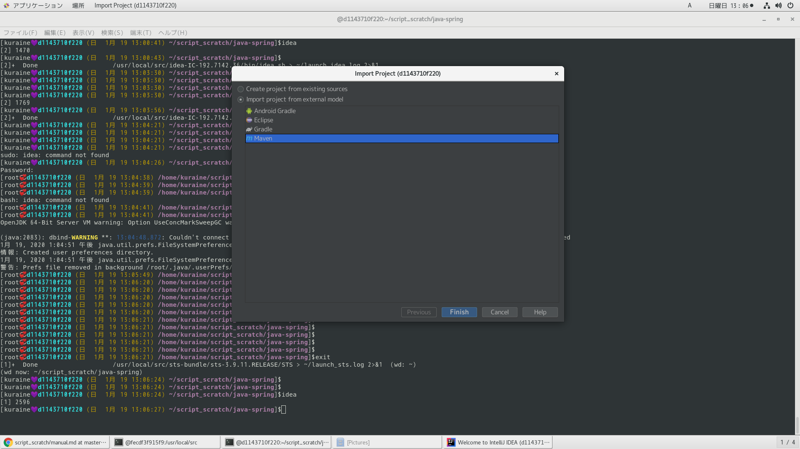
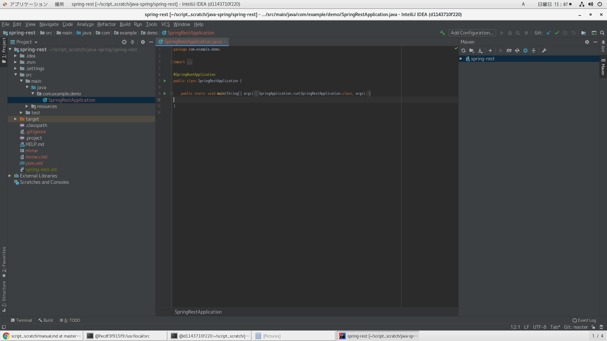

# フォルダ作成

フォルダ構成はテンプレ決まった後、素敵に作成。一番大事。
```
$mkdir -p lib src/{main,test}/java/{controller,launch}
```

# .gitignoreファイル作成

```
$touch /home/kuraine/script_scratch/java-ee/spring-app/.gitignore
```

以下を追記
```
/.idea/*
/.mvn/*
/.settings/*
/target/*
*.classpath
*.project
/lib/*
HELP.md
mvnw
mvnw.cmd
*.iml
```

# pom.xml作成

eclipseのstsプラグインで自動生成されるものを流用し、
必要なライブラリはdependencyディレクティブで追記していく。


# spring-bootプロセス起動・停止方法


## mavenコマンドのspring-bootプラグインでCUIから実行

プロセス起動
```
$mvn spring-boot:run 1>~/launch_spring-boot.log 2>&1 </dev/null &
```

ログ確認
```
$tail -f ~/launch_spring-boot.log
```

プロセス確認
```
$ps aux
```

URLアクセス
```
http://localhost:8080/
```

プロセス停止
```
$kill プロセス番号
```

プロセス確認
```
$ps aux
```

ログ確認
```
$tail -f ~/launch_spring-boot.log
```

## sts組み込みサーバーを利用しGUIから実行

各プロセス操作ログはコンソールに出力される

プロセス起動

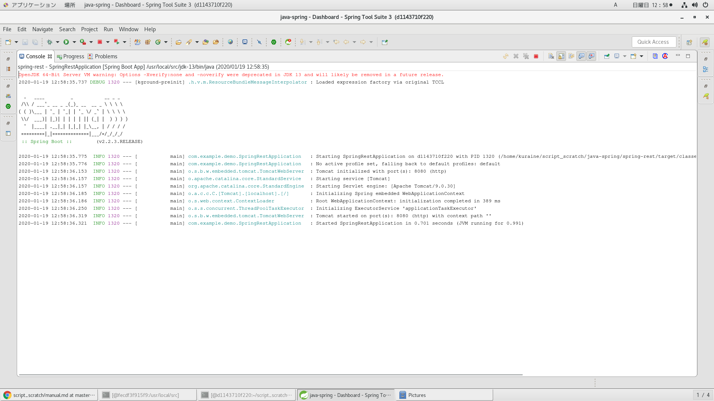

プロセス確認
```
$ps aux
```

プロセス停止
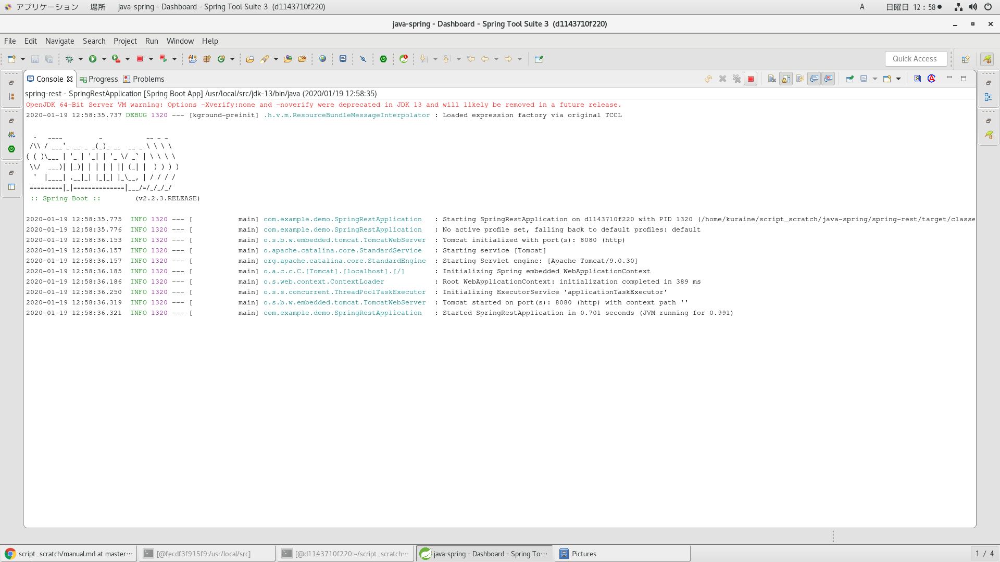
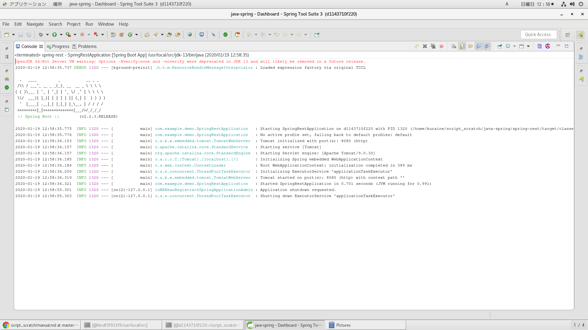

プロセス確認
```
$ps aux
```

## jarファイルを作成してjavaコマンド経由で実行

pom.xmlファイルのpackagingディレクティブをjarにして以下のコマンドを実行

```
$mvn package
```

jarファイル存在確認
```
$ll target/プロジェクト名-バージョン.jar
```

jarファイル中身確認

```
$jar tf target/プロジェクト名-バージョン.jar
```

<details><summary>開く</summary><div>

</div></details>


プロセス起動
```
$java -jar target/demo-0.0.1-SNAPSHOT.jar 1>~/launch_spring-boot.log 2>&1 </dev/null &
```

プロセス確認
```
$ps aux
```

ログ確認
```
$tail -f ~/launch_spring-boot.log
```

URLアクセス
```
http://localhost:8080/
```

プロセス停止
```
$kill プロセス番号
```

プロセス確認
```
$ps aux
```

ログ確認
```
$tail -f ~/launch_spring-boot.log
```

## warファイルを作成してsts組み込みサーバー以外に配備して実行

* SpringBootServletInitializerクラスを継承してconfigureメソッドをオーバーライドしておく必要がある

```
@SpringBootApplication
public class Application extends SpringBootServletInitializer {
    @Override
    protected SpringApplicationBuilder configure(SpringApplicationBuilder application) {
        return application.sources(Application.class);
    }
    public static void main(String[] args) {
        SpringApplication.run(Application.class, args);
    }
}
```

pom.xmlファイルのpackagingディレクティブをwarにして以下のコマンドを実行

```
$mvn package
```

warファイル存在確認
```
$ll target/プロジェクト名-バージョン.war
```

warファイル中身確認

```
$jar tf target/プロジェクト名-バージョン.war
```

<details><summary>開く</summary><div>

</div></details>

warファイルを配備

各サーバーのwebappsディレクトリに移動

この例はapache-tomcat

```
$mv target/プロジェクト名-バージョン.war ~/apache-tomcat-9.0.30/webapps
```

移動確認
```
$ll ~/apache-tomcat-9.0.30/webapps
```

プロセス起動

```
catalina.sh start 1>~/launch_spring-boot.log 2>&1
```

プロセス確認
```
$ps aux
```

ログ確認
```
$tail -f ~/launch_spring-boot.log
```

URLアクセス
```
http://localhost:8080/プロジェクト名-バージョン/
```

プロセス停止
```
$kill プロセス番号
```

プロセス確認
```
$ps aux
```

ログ確認
```
$tail -f ~/launch_spring-boot.log
```
