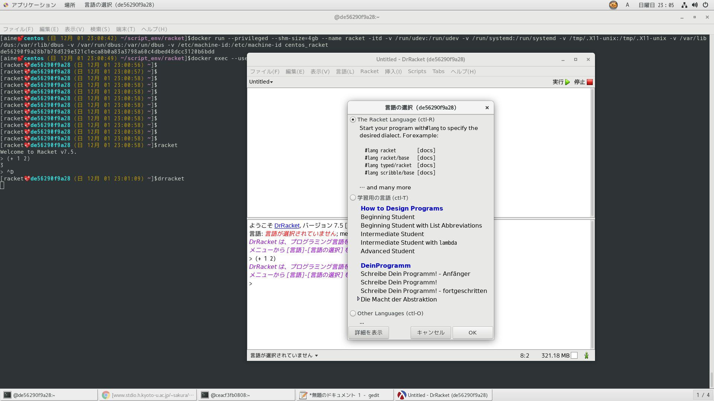
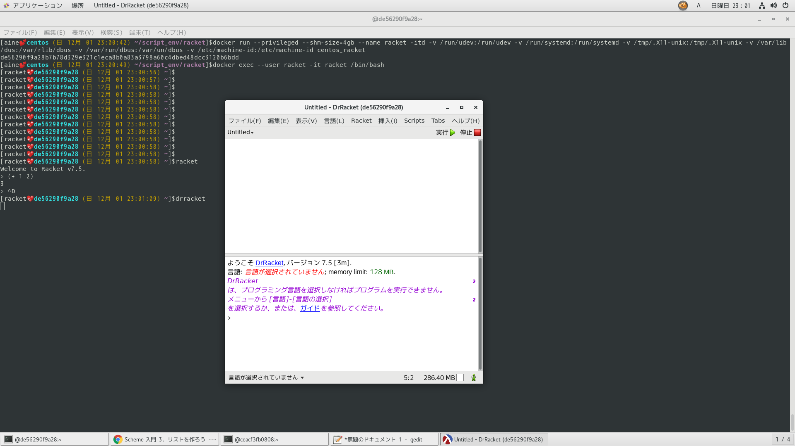
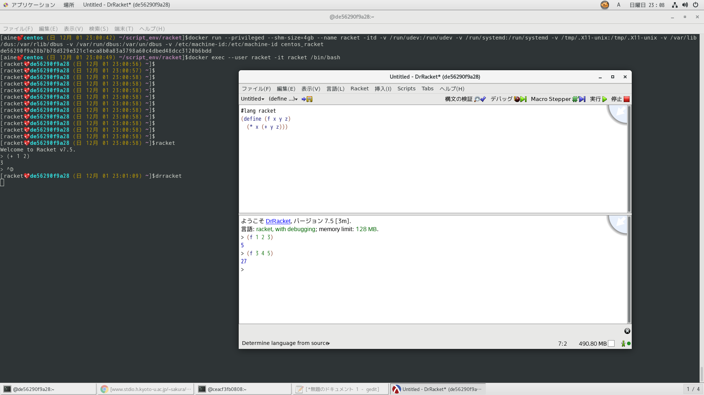

オレンジ色
https://riptutorial.com/ja/racket/example/10732/%E9%96%A2%E6%95%B0%E3%81%AE%E5%AE%9A%E7%BE%A9
racket公式ページ
https://download.racket-lang.org/
https://docs.racket-lang.org/quick/index.html

drracketの使い方
http://www.stdio.h.kyoto-u.ac.jp/~sakura/scheme/racket/Racket.html

http://www.shido.info/lisp/idx_scm.html
http://www.shido.info/lisp/scheme3.html

```
$racket -e '(define (f x y z) (* x (+ y z))) (f 1 2 3)'
5
```

drracket便利。ファイル保存もできる。




